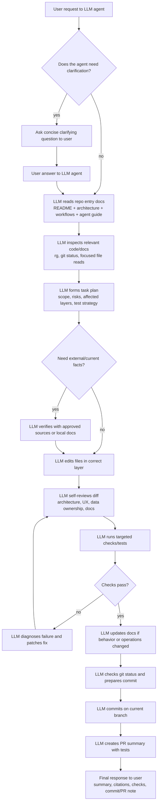

# AI Agent Guide

This repo is designed to be understandable by AI coding agents. Follow this guide before making non-trivial changes.

## First reading path

1. `README.md` for product scope, commands, and doc links.
2. `docs/architecture.md` for system boundaries and layering.
3. `docs/application-workflows.md` for user-facing behavior.
4. `docs/engineering-decisions.md` for accepted trade-offs.
5. Feature-local README files when they exist, such as the Gmail interaction panel or extension docs.


## End-to-end agent workflow

Every box in this Mermaid chart is an intentional LLM interaction point: either the user is talking to the agent, the agent is using the LLM to reason over repository context, or the agent is asking the LLM to synthesize implementation, validation, and communication.



Use the chart as the default operating loop. Skip only the steps that are truly not applicable, and make that obvious in the final response when it affects confidence or validation.

## Safe change workflow

1. Identify the feature slice: web UI, API route/controller/service/repository, shared package, integration, or infrastructure.
2. Check existing names and patterns before adding files.
3. Keep changes inside the correct layer.
4. Add or update docs when behavior, operations, or architecture changes.
5. Run targeted checks first, then broader checks when practical.
6. Summarize what changed, what was tested, and any operational follow-up.

## Layering checklist

- Routes should not contain Prisma queries.
- Controllers should not contain provider-specific implementation details.
- Services should not know Express `Request`/`Response` objects.
- Repositories should not call external APIs.
- UI should not call provider APIs directly.
- Shared packages should remain app-agnostic and avoid cycles.
- Owner-scoped data access must include `ownerEmail` server-side.

## AI feature checklist

When changing parser, research, or classifier behavior:

- Keep prompts and schemas close to the service/package that owns them.
- Treat AI output as untrusted input; validate and normalize it.
- Preserve source traceability for user review.
- Prefer deterministic source data before inference.
- Add examples/tests for ambiguous cases.
- Do not log raw private content unless it is sanitized and necessary.

## UI/UX checklist

- Creation workflows should be focused, reviewable, and not hidden in cramped drawers.
- Drawers are best for reading/detail context; modals or pages are better for creation/edit flows.
- AI-generated changes should be shown as drafts or diffs when they affect existing user data.
- Reuse design-system primitives and semantic tokens before adding new ad-hoc components.

## Common commands for agents

```sh
yarn typecheck
yarn build
yarn build:api
yarn build:web
yarn smoke:api
yarn build:storybook
```

Use narrower tests when available near the touched code, for example `tsx`/test targets defined in project scripts or colocated `*.test.ts` files.

## Documentation policy

Keep durable knowledge; remove one-off fix summaries after their content is merged into architecture, workflow, operation, or feature docs.

Good documentation:

- explains current behavior;
- names real files, services, and commands;
- says when to use a workflow;
- captures constraints and decisions;
- helps future AI agents avoid repeating past mistakes.

Poor documentation:

- only says “fixed” or “implemented”;
- duplicates another guide;
- references stale PR comments;
- contains secrets or personal one-off values;
- describes behavior that no longer exists.
