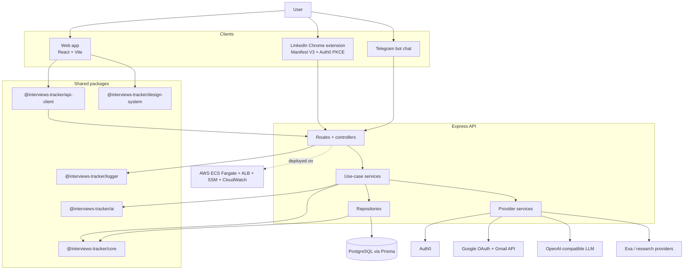
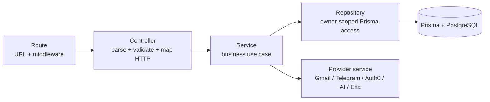

# Architecture Overview

Interviews Tracker is a personal, owner-scoped job-search CRM. The architecture optimizes for fast feature work while keeping business rules, persistence, integrations, and UI composition separate enough for AI agents and human developers to change safely.

## System context



## Runtime applications

### `apps/web`

React + Vite frontend for CRM workflows. It owns pages, feature components, local interaction state, React Query data fetching, and UI composition. It must not import Prisma, server-only modules, provider SDKs, or duplicate domain enums that already exist in shared packages.

### `apps/api`

Express API for authenticated CRM operations and provider webhooks. It owns HTTP routing, request validation, use-case orchestration, persistence, authentication, external integration calls, and operational endpoints.

### `apps/linkedin-extension`

Manifest V3 Chrome extension that extracts job data from LinkedIn pages and submits it to the API. It uses Auth0 Authorization Code Flow with PKCE through `chrome.identity.launchWebAuthFlow` and keeps a manual token fallback for development/testing.

## Backend layering

Use this flow for new API work:



- **Routes** register URLs and middleware only.
- **Controllers** parse request data, call services, and map service results/errors to HTTP responses.
- **Services** own use-case orchestration and business rules.
- **Repositories** own Prisma reads/writes and owner scoping.
- **Provider services** own external APIs such as Gmail, Telegram, Auth0, Exa, and AI parsing.
- **Mappers/normalizers** translate database objects to API DTOs and normalize backward-compatible fields.

Current examples include opportunity and interaction controllers/services/repositories, Gmail services, Telegram services, company/person research services, and job import services.

## Shared packages

```text
packages/core          Domain types, enums, DTO schemas, shared labels
packages/ai            AI parser/research contracts and prompt helpers
packages/integrations  Pure provider DTOs/helpers that are safe to share
packages/api-client    Browser-safe typed API client
packages/design-system Business-agnostic UI primitives and tokens
packages/logger        Structured logging interface and adapters
```

Dependency direction:

```text
apps -> packages
api-client -> core, ai, integrations
ai -> core
integrations -> core
core -> none
```

Do not create cycles. If a shared package needs app-specific behavior, keep that behavior in the app and pass data/functions into the package boundary instead.

## Data model and ownership

The database is opportunity-first:

- `JobOpportunity` is the aggregate root for a company/role process.
- `Interaction` represents calls, interviews, recruiter conversations, and milestones.
- `InteractionEmail` attaches one or more Gmail messages to an interaction for traceability.
- `InteractionFeedback` stores raw feedback text and AI-extracted metadata.
- `Person`, `Note`, `Task`, `Compensation`, and option tables enrich opportunities.
- `ownerEmail` scopes user-owned records and must be included in queries for user data.

`ownerEmail` is the current isolation mechanism. Repository code should enforce it consistently; UI code should never rely on client-side filtering for security.

## Important workflows at architecture level

### Opportunity creation

```text
Manual form / pasted text / LinkedIn extension / Telegram message
  → API validation
  → parser or import service when needed
  → opportunity service
  → opportunity repository
  → Prisma/PostgreSQL
  → API DTO
  → React Query cache update/invalidation
```

### Gmail interaction import

```text
User connects Gmail
  → Google OAuth tokens encrypted/stored
  → Gmail search by company/context
  → message fetch
  → AI extraction to draft interaction
  → user review
  → interaction save + source email attachment
```

### Telegram bot

```text
Telegram update
  → webhook secret validation
  → allowed user/chat authorization
  → command handling OR AI intent classification
  → create opportunity or answer opportunity query
  → Telegram response formatter/client
```

## Build and runtime discipline

Yarn workspaces install dependencies; Nx orchestrates project builds and task dependencies. Production start scripts run already-built JavaScript and should not compile TypeScript at runtime.

- `yarn build` builds every Nx project.
- `yarn build:api` builds API and required packages.
- `yarn build:web` builds Vite output for the web app.
- Shared runtime packages imported by the API must export built `dist` files, not `src/*.ts`.

## Security boundaries

- Browser code must use public `VITE_*` variables only.
- API secrets live in environment variables or AWS SSM Parameter Store.
- Telegram webhook requests require Telegram and internal shared secrets.
- Gmail tokens are separate from Auth0 tokens and must remain encrypted at rest.
- Logs must not include bearer tokens, refresh tokens, API keys, raw request bodies, or private email content unless explicitly sanitized.
